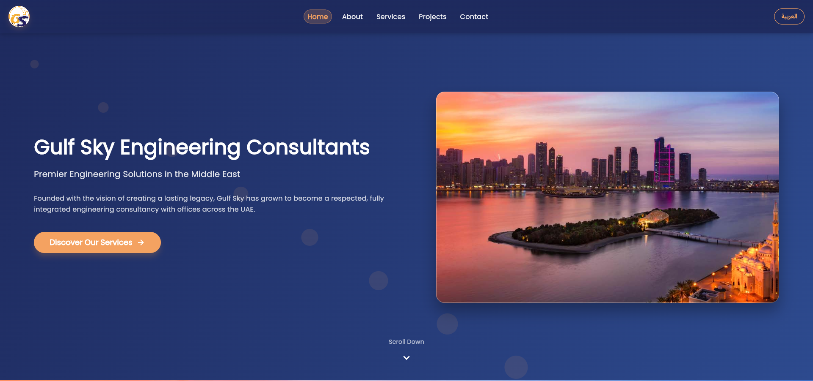
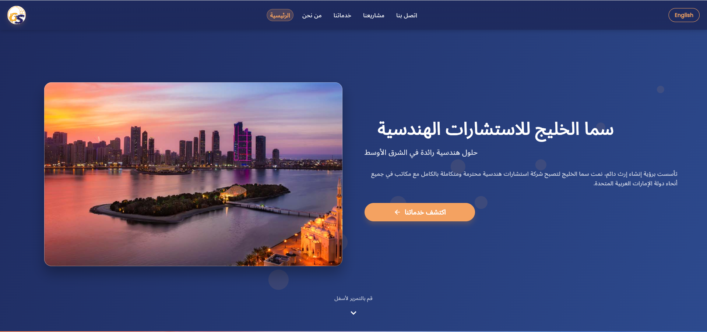
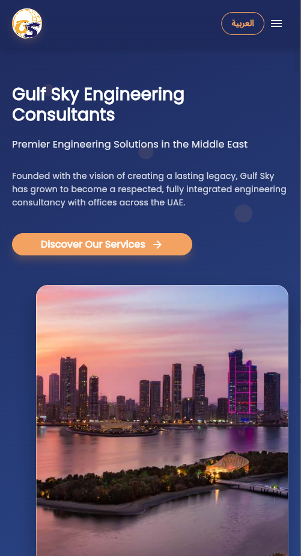

# 🌐 Gulf Sky Engineering Consultants  
### Official Corporate Website – Flutter Web

<p align="center">
  
</p>

<p align="center">
  <strong>Professional Engineering & Consultancy Solutions</strong><br/>
  UAE & Middle East
</p>

---

## 🏢 About the Project

This repository contains the source code of the **official corporate website** for  
**Gulf Sky Engineering Consultants**.

The website presents the company profile, services, projects, and contact information through a modern, clean, and responsive user interface built with **Flutter Web**.

---

## ✨ Website Sections

- 🏠 **Home** – Brand introduction & identity  
- 🏢 **About Us** – Vision, mission, and company overview  
- 🛠️ **Services** – Engineering & consultancy services  
- 🏗️ **Projects** – Completed and ongoing projects  
- 📩 **Contact Us** – Communication and inquiry section  

---

## 🎯 Key Features

✔️ Clean & elegant corporate UI  
✔️ Fully responsive (Desktop / Tablet / Mobile)  
✔️ Custom animated loading screen  
✔️ Interactive project cards  
✔️ Full-screen project image preview (Dialog)  
✔️ Optimized Flutter Web build  
✔️ Ready for static hosting  

---
---

## 📸 Screenshots

### Home Page - en
<p align="center">
  
</p>

### Home Page - ar
<p align="center">
  
</p>

### Mobile View
<p align="center">
  
</p>
---

## 🧰 Tech Stack

| Technology | Description |
|----------|------------|
| **Flutter Web** | Frontend framework |
| **Dart** | Application logic |
| **HTML** | Web entry point |
| **CSS** | Loader & basic styling |
| **Material Design** | UI components |

---

## 📂 Project Structure

```text
├── lib/                # Flutter source code
├── web/                # index.html, icons, manifest
├── assets/             # Images & static resources
├── build/web/          # Production build output
└── pubspec.yaml        # Dependencies & configuration


